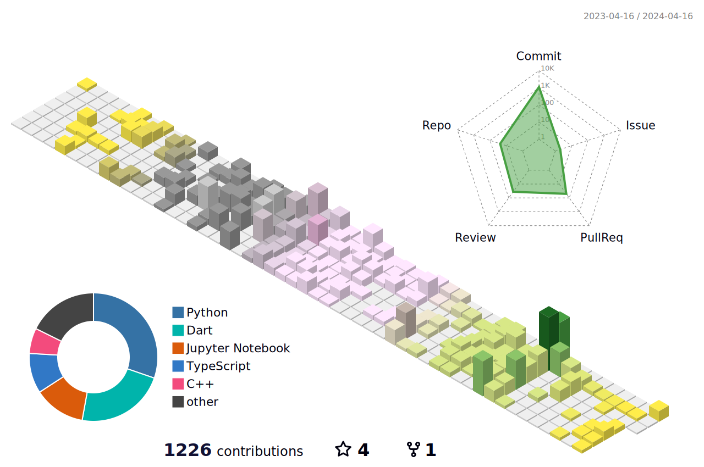

<!-- -->

 

## HaEun 🎬

 

<a href="https://github.com/YunHaaaa"></a>

  

---

 
  
  <!-- Programming -->
  #### Programming:
  
  
  
  

  <!-- Frameworks -->
  #### Frameworks:
  
  

  <!-- Deep Learning -->
  #### Deep Learning:
  
  
  
  

  <!-- Development Tools -->
  #### Development Tools:
  
  
  
  

  <!-- Tooling/ DevOps -->
  #### Tooling/ DevOps
  

  <!-- Collaboration tools -->
  #### Collaboration tools
  
  
  
  
  

  

